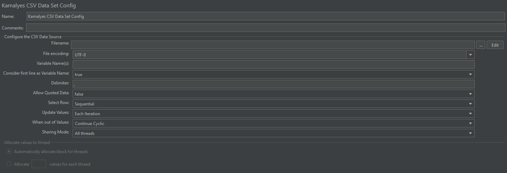

# Jmeter Csv数据集配置

## 介绍

这个插件在JMeter默认的CSV数据集配置元素上提供了额外的功能。这也提供了额外的参数化特性。

## 预览



## 所需组件&版本

- Apache JMeter组件
- Apache JMeter核心
- Jmeter版本5.1.1或以上
- Java 8或以上

## 安装说明

- 从GitHub下载源代码。
- mvn clean deploy --settings ./setting.xml
- Jar将在目标目录下生成(jmeter-csv-dataset-config-xx.jar)。
- 复制Jar到<Jmeter安装目录>/lib/ext/

备注：

```bash
mvn clean package依次执行了clean、resources、compile、testResources、testCompile、test、jar(打包)等７个阶段。
mvn clean install依次执行了clean、resources、compile、testResources、testCompile、test、jar(打包)、install等8个阶段。
mvn clean deploy依次执行了clean、resources、compile、testResources、testCompile、test、jar(打包)、install、deploy等９个阶段。
package命令完成了项目编译、单元测试、打包功能
install命令完成了项目编译、单元测试、打包功能，同时把打好的可执行jar包（war包或其它形式的包）布署到本地maven仓库
deploy命令完成了项目编译、单元测试、打包功能，同时把打好的可执行jar包（war包或其它形式的包）布署到本地maven仓库和远程maven私服仓库
```

## 有什么新鲜事吗?

- 改进了新的GUI

- 增加了创建新文件的功能

- 添加功能，编辑csv文件与默认的文本编辑器

- 修正引用数据问题

- 修正了相对路径问题

- 支持大csv(移出内存读取)

## 选项

✨ 此版本无需记住下面的组合表 ✨

这允许读取 CSV 数据，如下所示

- 选择行（顺序|随机|唯一）
- 更新值（每次迭代|一次）
- 当超出值时（继续循环|继续最后一个值|中止线程）

下表是使用此插件时允许的组合
| Select Row | Update value | Out of Values | Allocate Block Size |
| ------ | -------- | ------------------ | ---------- |
| 顺序   | 每次迭代 | 继续循环           | 不适用     |
| 顺序   | 每次迭代 | 中止线程           | 不适用     |
| 顺序   | 每次迭代 | 继续最后一个值     | 不适用     |
| 顺序   | 一次     | 不适用             | 不适用     |
| 随机的 | 每次迭代 | 不适用             | 不适用     |
| 随机的 | 一次     | 不适用             | 不适用     |
| 独特的 | 每次迭代 | 继续使用最后一个值 | 启用       |
| 独特的 | 每次迭代 | 继续循环           | 启用       |
| 独特的 | 每次迭代 | 中止线程           | 启用       |
| 独特的 | 一次     | 不适用             | 不适用     |

## 引用

- [rollno748-Extended-csv-dataset-config](https://github.com/rollno748/Extended-csv-dataset-config)
